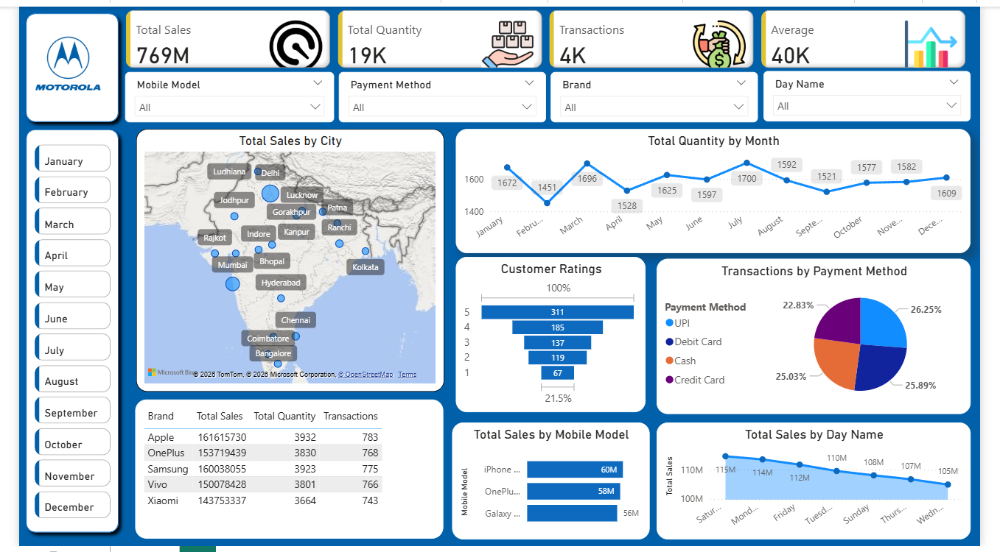

# 📊 Mobile Sales Analysis Dashboard - Power BI

## 📌 Project Overview
This Power BI dashboard analyzes mobile phone sales performance across cities, brands, and payment methods to generate business insights and support data-driven decisions.

---

## 🛠 Tools & Technologies Used
- Microsoft Power BI
- Excel Dataset
- DAX (Data Analysis Expressions)

---

## 📊 Key Metrics (KPI Cards)
- Total Sales – Card Visualization
- Total Quantity – Card Visualization
- Total Transactions – Card Visualization
- Average Sales – Card Visualization

---

## 📈 Visualizations Used in the Dashboard

### 🌍 1. Total Sales by City
- **Map Visualization**
- Displays city-wise sales distribution across India.

### 📅 2. Total Quantity by Month
- **Line Chart**
- Shows monthly sales quantity trend.

### ⭐ 3. Customer Ratings
- **Funnel Chart**
- Displays distribution of ratings (1–5).

### 💳 4. Transactions by Payment Method
- **Pie Chart**
- Shows percentage share of UPI, Debit Card, Cash, and Credit Card.

### 🏷 5. Brand Performance
- **Table Visualization**
- Displays brand-wise Total Sales, Quantity, and Transactions.

### 📱 6. Total Sales by Mobile Model
- **Bar Chart**
- Compares sales performance across different mobile models.

### 📆 7. Total Sales by Day Name
- **Line Chart**
- Analyzes sales performance by weekday.

### 🎛 8. Interactive Filters (Slicers Used)
- Month (Button-style slicer)
- Brand (Dropdown slicer)
- Payment Method (Dropdown slicer)
- Mobile Model (Dropdown slicer)
- Day Name (Dropdown slicer)

---

## 💡 Business Insights
- Identifies top-performing cities and brands.
- Highlights peak sales months.
- Analyzes preferred payment methods.
- Evaluates customer satisfaction levels.

---

## 📷 Dashboard Preview

---

## 🎯 Conclusion
The dashboard provides a comprehensive overview of mobile sales performance and helps businesses track revenue, customer behavior, and product performance effectively.

---

## 👤 Author
Sampath Reddy  
Aspiring Data Analyst
